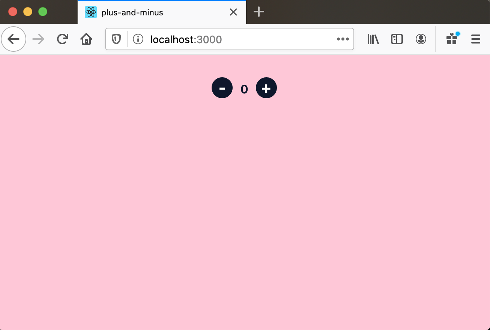

# plus-and-minus

Just a simple React experiment.


## Pre-requisites

**Node.js** and **yarn** need to be installed.

The following versions of the above-mentioned systems were used in the creation of this project.

```
$ node -v
v12.18.2
$ yarn -v
1.22.4
```

## Installation

Run `yarn` to install the project dependencies.

## Starting the app

Run `yarn start` to start the application.

> After starting the app, it should be automatically opened, and you should see something like the image below.



Try clicking the minus and plus buttons to play around.

___

Made with 💖 by [Walmyr Filho](https://walmyr.dev).
